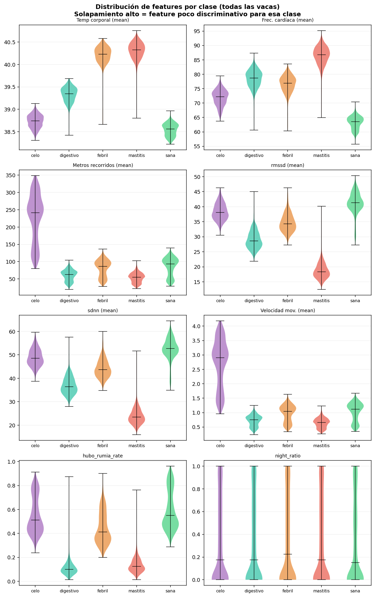

# Research & Data Acquisition

# Scientific References — DAMP
> Bovine physiological parameters used in the synthetic data generator

---

## Synthetic Data Generation

To ensure robust **initial operation** and allow the training of Machine Learning models without relying on a physical sensor infrastructure deployed for months, we have developed an advanced simulation engine in the [SeedService](backend/app/modules/seed/service.py).

### Simulation Methodology

Data generation is not random, but follows a simulation architecture based on three pillars:

#### 1. Physiological Modeling (State Vectors)
We use a matrix of base parameters (temperature, heart rate, HRV, rumination frequency) extracted from the previous scientific references. Each health status (`Healthy`, `Mastitis`, `Heat`, `Febrile`, `Digestive`) acts as a profile that defines:
- **Mean ($μ$):** Expected value for the metric in that state.
- **Standard Deviation ($σ$):** Natural variability of the individual.

#### 2. Temporal Dynamics and Circadian Cycles
To make the data temporally realistic, the generator applies:
- **Circadian Variation:** We model temperature and activity with peaks during grazing hours (7:00 and 17:00) and nocturnal decreases using Gaussian functions.
- **State Transitions:** The "life stories" of the cows simulate the progress of a disease (e.g., a cow that starts healthy, enters a febrile state, and then recovers), allowing the model to learn the *trend* rather than just the point value.

#### 3. Simulation of Real Errors and Noise
To train resilient models, we artificially introduce:
- **Correlated Noise:** Simulation of environmental interference affecting multiple sensors simultaneously.
- **Sensor Failures (Outliers):** Probabilty of ~0.8% of erratic or null readings (dropouts) to force the model to handle incomplete data.
- **Cardiac Artifacts:** Random heart rate peaks that do not correspond to pathologies, simulating sudden movements or momentary stress.

### Technical Implementation
The process is performed in a **vectorized** manner using **NumPy**, achieving the generation of full histories (e.g., 21 cows for 7 days with readings every 5 minutes) in less than 5 seconds. This speed is critical for development environments and continuous integration tests.

### Feature Distribution Analysis
Below is the distribution of the generated biometric variables according to each health label, validating that the simulation engine respects the researched physiological ranges:

---

## Body Temperature
> `BASE = 38.6°C` · mastitis `+1.8°C` · febrile `+1.7°C`

- Kim et al. (2019) — *Real-time temperature monitoring for early detection of mastitis*
  https://www.sciencedirect.com/science/article/abs/pii/S0168169918308494

- PMC4698711 — *Body Temperature Monitoring Using Subcutaneously Implanted Thermo-loggers in Cattle*
  https://pmc.ncbi.nlm.nih.gov/articles/PMC4698711/

---

## Heart Rate
> `BASE = 65 bpm` · mastitis `+24` · heat `+9` · normal range 60–80 bpm at rest

- PMC4546236 — *Heart Rate and HRV in Dairy Cows with Different Temperament*
  https://pmc.ncbi.nlm.nih.gov/articles/PMC4546236/

---

## HRV — RMSSD and SDNN
> `BASE rmssd = 40 ms` · mastitis `−26 ms` · digestive `−14 ms` · SDNN = rmssd × 1.1–1.45

- MDPI Sensors (2018) — *Recording HRV of Dairy Cows to the Cloud*
  https://www.mdpi.com/1424-8220/18/8/2541

- OUCI — *Maternal, fetal and neonatal HR and HRV in Holstein cattle*
  https://ouci.dntb.gov.ua/en/works/lxeEPq09/

- Bovine Vet (2021) — *Heart Rate Variability Can Help Assess Stress and Pain*
  https://www.bovinevetonline.com/news/veterinary-education/heart-rate-variability-can-help-assess-stress-and-pain

---

## Movement / Speed — Heat
> heat `+2.8 m/s` · nocturnal Gaussian pattern centered at 11:00 PM · mastitis `−1.1 m/s`

- Cambridge Animal (2017) — *Behavioral signs of estrus and fully automated detection systems*
  https://www.cambridge.org/core/journals/animal/article/review-behavioral-signs-of-estrus-and-the-potential-of-fully-automated-systems-for-detection-of-estrus-in-dairy-cattle/0C4FCAEE6973AB21FC33C02C8403AC51

- Frontiers in Animal Science (2023) — *Behavioral changes to detect estrus using ear-sensor accelerometer*
  https://www.frontiersin.org/journals/animal-science/articles/10.3389/fanim.2023.1149085/full

- ScienceDirect (2019) — *Calving and estrus detection using localization + accelerometer*
  https://www.sciencedirect.com/science/article/abs/pii/S0168169919315261

- PMC7401617 — *ML Techniques for Estrus Detection Using Location and Acceleration Data*
  https://pmc.ncbi.nlm.nih.gov/articles/PMC7401617/

---

## Rumination
> `BASE p_rumia = 0.52` · nocturnal boost `+60%` · digestive `−0.44` · mastitis `−0.42`
> Healthy cows ruminated 7–8 hours/day, mainly at night

- PMC8547861 — *Using rumination time to manage health and reproduction in dairy cattle*
  https://pmc.ncbi.nlm.nih.gov/articles/PMC8547861/

- PMC9994596 — *Variations in 24h temporal patterns of grazing and rumination*
  https://pmc.ncbi.nlm.nih.gov/articles/PMC9994596/

- Allflex White Paper — *Rumination Monitoring in Dairy Cattle*
  https://www.allflex.global/wp-content/uploads/2021/09/Rumination-Monitoring-White-Paper.pdf

---

## Circadian Rhythm
> `circ(h)` function with peaks at 7:00 AM and 5:00 PM · temperature `−0.25°C` at night · HR `−7 bpm` at night · speed `~15%` of daytime

- Frontiers in Animal Science (2022) — *Ultra- and Circadian Activity Rhythms of Dairy Cows in AMS*
  https://www.frontiersin.org/journals/animal-science/articles/10.3389/fanim.2022.839906/full

---

## Wearable Sensors — General Approach Validation

- PMC8044875 — *Systematic Review: Validated Sensor Technologies for Welfare Assessment of Dairy Cattle*
  https://pmc.ncbi.nlm.nih.gov/articles/PMC8044875/

- PMC8532812 — *Wearable Wireless Biosensor Technology for Monitoring Cattle*
  https://pmc.ncbi.nlm.nih.gov/articles/PMC8532812/

